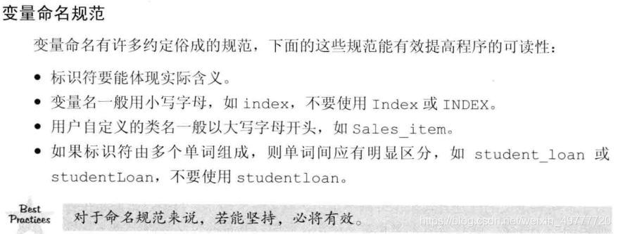
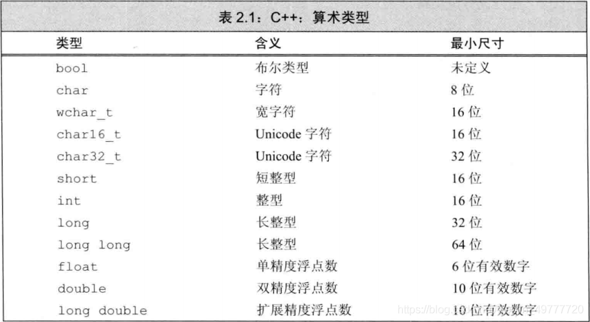
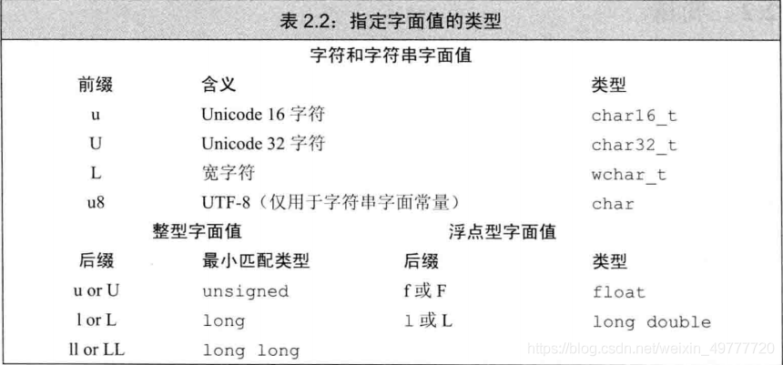
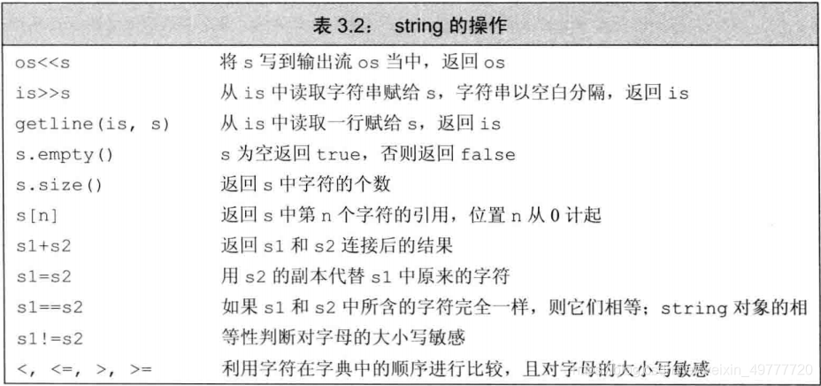
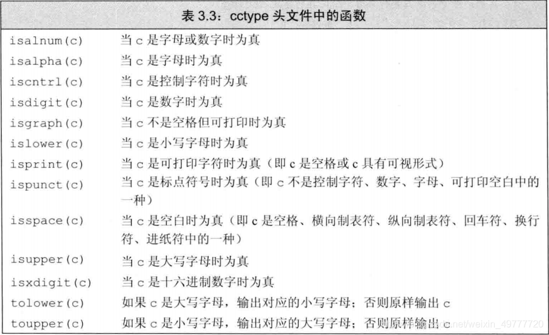

# Hello world

c++的第一个程序

```cpp
#include<iostream>
using namespace std;
void main(void) {
	cout << "Hello world!";
}
```

# 变量

变量提供一个具名的、可供程序操作的存储空间。

对象：对象是指一块能储存数据并具有某种类型的内存空间。

**初始化**

当对象在创建时获得了一个特定的值，我们就说这个对象被初始化了。

+ 在C++中初始化和赋值不能混为一谈

```cpp
int units_sold = 0;
int units_sold = { 0 };
int units_sold{ 0 };
int units_sold(0);
```

花括号的初始化方法被称为**列表初始化**。

**默认初始化**：如果我们没有指定初始值，则变量会被默认初始化。

**建议初始化每一个内置类型的变量**

## 变量的声明和定义

C++语言支持分离式编译。

为了支持分离式编译，C++语言将声明和定义区分开来。

声明：一个文件想要使用别处定义的名字必须包含对那个名字的声明。

定义：定义负责创建与名字关联的实体。

声明不能初始化变量。

**变量只能被定义一次，但是可以被声明多次。**

```cpp
extern int i;//这是声明
```

**变量名命名规范**




## 变量名的作用域

变量名的作用域以花括号为界。和C语言类似

**建议：当你第一次使用变量的时候定义他。**

# 基本类型

## 基本内置类型

**算术类型**：算术类型是最基本的类型，是用来存储一个数字，或一个字符的类型，



**字面值常量**

在程序中，42，就是一个字面值常量，“”，其中的内容也是字面值常量。

默认的整数为int型（超出int存储范围的可能为long型或long long型）。

用单引号的单个字符默认为char型，双引号的字符默认为字符串数组型。

浮点数默认为double型。

用前缀和后缀可以定义字面值常量的类型，具体用法如下。



## 复合类型

**引用**：引用为对象起了另外一个名字，引用类型引用另外一种类型。

引用在定义时就要初始化，引用和被引用的变量指向同一个内存空间。

```cpp
int &refVal=ival;//这是引用
int*&r=p;//r是一个对指针p的引用
```

## const 限定符

对于变量来讲，加上const就变成了一个常量，不能同过赋值运算符改变const定义的变量。

对于指针来讲，const分为顶层指针和底层指针

```cpp
int i=1;
int j=2;
const int *p1;//这个是底层指针
p1=&i;//不能通过p1修改i的值，但可以让p1指向&j
int *const p2=&i;//这个是顶层指针，不能改变p2指向的对象，一开始定义就要初始化
```

**constexpr**:这个变量所声明的值必须是常量表达式。

```cpp
constexpr int*p1;//这类似于顶层指针，不能改变p1指向的对象，定义时要初始化
```

## 处理类型

auto和decltype是两个重要的处理类型，auto可以自动判断所设变量的类型，decltype可以自动判断函数的返回值类型。

# 命名空间using声明

每一个库函数都有一个命名空间，通过using可以省略“std：：”的使用。

# 标准库string

定义在string头文件中

使用string类型必须添加头文件

```cpp
#include<string>
```



**s.size()**: s.seze()的返回值是一个无符号数，如果和有符号的负数比较，结果一定是true。

C++支持字符串相加，但不能将字面量与字面量相加。

**string处理字符的库：cctype头文件**



# vector类型

定义在vector头文件中

暂不理解，以后再写。

# 迭代器


# 数组

数组与vector相似，都是存放类型相同的对象的容器，但数组大小确定不变，不能随意增加元素。

cstddef头文件：size_t(无穷大的int型)，ptrdiff_t(两个指针相减的类型)

iterator头文件：begin，end函数

cstring头文件：

