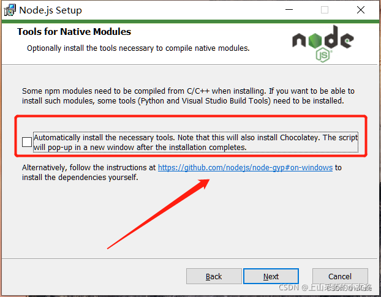

# Node.js安装

从[官网下载node.js](https://nodejs.org/en)最好选LTS版本
如果你需要运行vue2的项目，那你在安装过程中就要选择这个选项
同时你还需要安装python2.7和windows-build-tools，在cmd中输入下面的命令
```bash
npm install --global --production windows-build-tools
```
具体内容请看：[创建Vue项目报错python.EXE -c import sys； print “%s.%s.%s“ % sys.version_info[3]](https://blog.csdn.net/m0_67401499/article/details/123305011?ops_request_misc=%257B%2522request%255Fid%2522%253A%2522166540727316782412555541%2522%252C%2522scm%2522%253A%252220140713.130102334.pc%255Fall.%2522%257D&request_id=166540727316782412555541&biz_id=0&utm_medium=distribute.pc_search_result.none-task-blog-2~all~first_rank_ecpm_v1~rank_v31_ecpm-2-123305011-null-null.142%5Ev52%5Econtrol,201%5Ev3%5Eadd_ask&utm_term=node-sass%E5%AE%89%E8%A3%85%E6%8A%A5%E9%94%99%20import%20sys;%20print%20%25s.%25s.%25s%20%25%20sys.version_info%5B:3%5D;&spm=1018.2226.3001.4187)