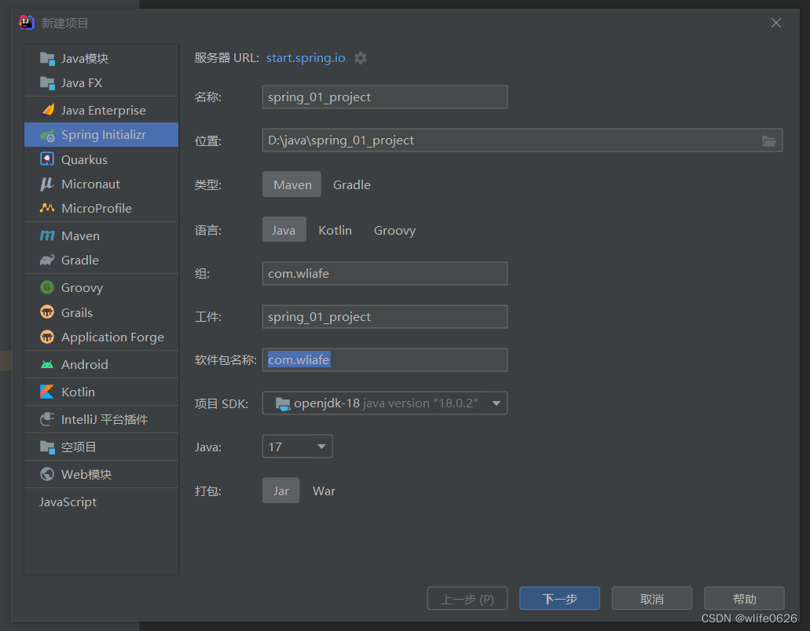
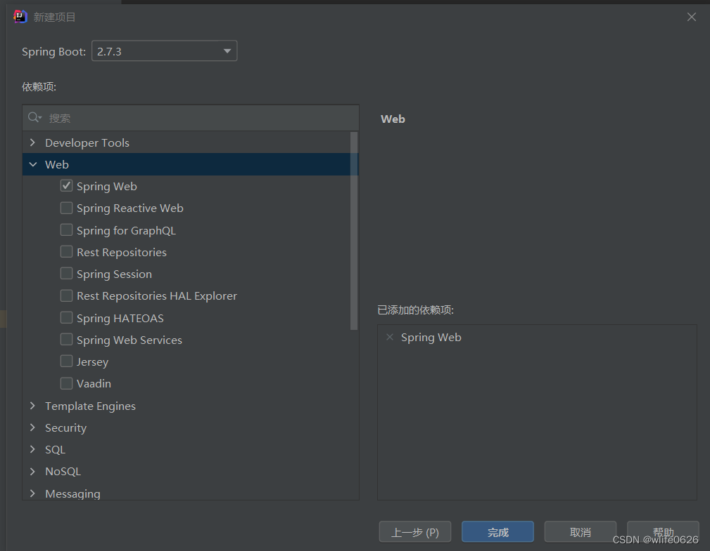
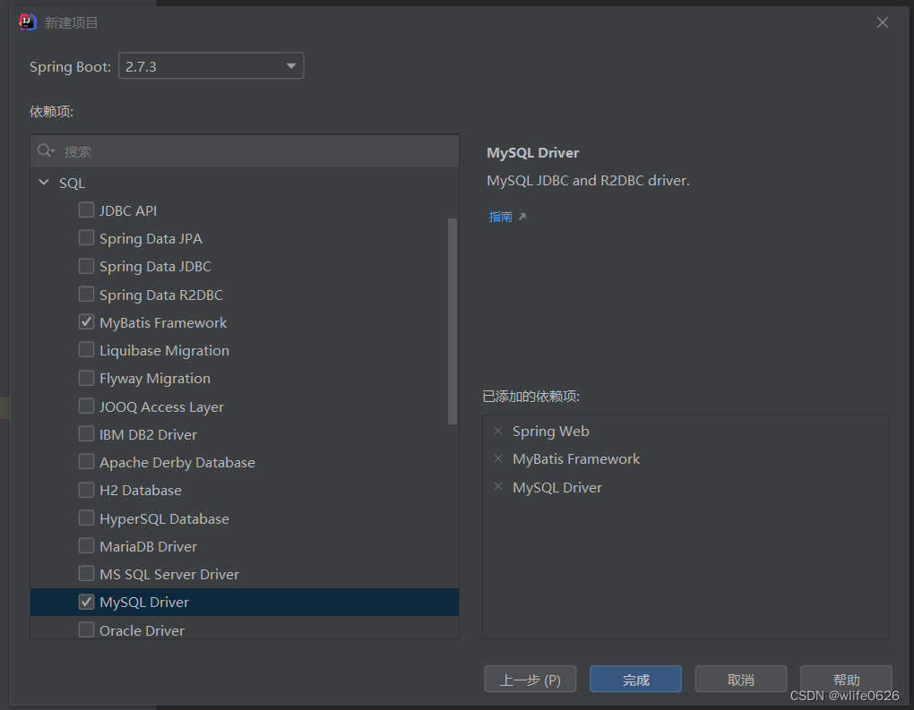
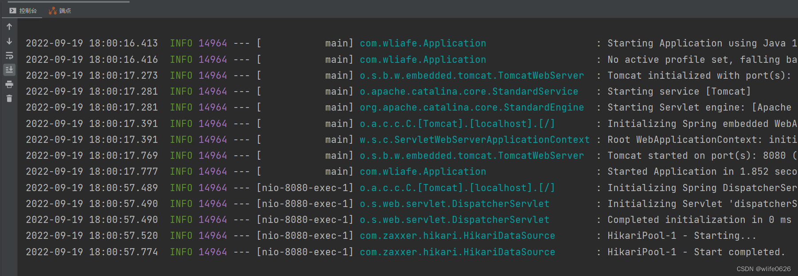
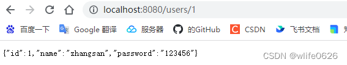

# 第一个项目

## 项目创建







## 文件编写

application.yml

```yml
spring:
  datasource:
    driver-class-name: com.mysql.cj.jdbc.Driver
    url: jdbc:mysql://192.168.1.120:3306/Users
    username: root
    password: Mysql.123
```

User.java

```java
public class User implements Serializable {
    private Integer id;
    private String name;
    private String password;

    @Override
    public String toString() {
        return "User{" +
                "id=" + id +
                ", name='" + name + '\'' +
                ", password='" + password + '\'' +
                '}';
    }

    public Integer getId() {
        return id;
    }

    public void setId(Integer id) {
        this.id = id;
    }

    public String getName() {
        return name;
    }

    public void setName(String name) {
        this.name = name;
    }

    public String getPassword() {
        return password;
    }

    public void setPassword(String password) {
        this.password = password;
    }
}
```

UserMapper

```java
@Mapper
public interface UserMapper {
    @Insert("insert into users(name,password) values(#{name},#{password})")
    void save(User user);

    @Delete("delete from users where id = #{id}")
    void delete(Integer id);

    @Update("update users set name= #{name},password= #{password} where id= #{id}")
    void update(User user);

    @Select("select * from users")
    List<User> findAll();

    @Select("select * from users where id = #{id}")
    User findById(Integer id);
}

```

UserService

```java
public interface UserService {
    boolean save(User user);

    boolean update(User user);

    boolean delete(Integer id);

    User findById(Integer id);

    List<User> findAll();
}
```

UserServiceImpl

```java
@Service
public class UserServiceImpl implements UserService {
    @Autowired
    private UserMapper userDao;

    public boolean save(User user) {
        userDao.save(user);
        return true;
    }

    public boolean update(User user) {
        userDao.update(user);
        return true;
    }

    public boolean delete(Integer id) {
        userDao.delete(id);
        return true;
    }

    public User findById(Integer id) {
        return userDao.findById(id);
    }

    public List<User> findAll() {
        return userDao.findAll();
    }
}
```

UserController

```java
@RestController
@RequestMapping("/users")
public class UserController {

    @Autowired
    UserService userService;

    @PostMapping
    public boolean save(@RequestBody User user) {
        userService.save(user);
        return true;
    }

    @PutMapping
    public boolean update(@RequestBody User user) {
        userService.update(user);
        return true;
    }

    @DeleteMapping("/{id}")
    public boolean delete(@PathVariable Integer id) {
        userService.delete(id);
        return true;
    }

    @GetMapping("/{id}")
    public User findById(@PathVariable Integer id) {
        return userService.findById(id);
    }

    @GetMapping
    public List<User> findAll() {
        return userService.findAll();
    }
}
```

## 运行



