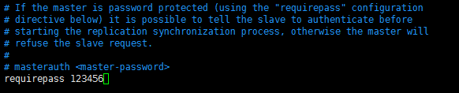
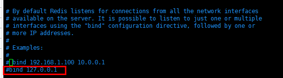

# 简介

后端环境包括Mysql数据库、redis和java。

这篇博客采用的是Ubuntu系统，只讲述MySQL数据库和redis的配置方法。

# Linux后端环境shell脚本

为了方便且快速地配置环境，这里我提供了自己编写的shell脚本，脚本的仓库为[java-web-environment](https://gitee.com/wliafe/java-web-environment.git)

脚本MySQL数据库的配置原理和博客不同，采用的是docker的方法，更加简便，且更易写成脚本。

# Mysql数据库

## 安装MySQL

```bash
# 安装MySQL服务器
apt install mysql-server
# 启动MySQL服务
systemctl start mysqld 
service mysql start
# 重启MySQL服务
service mysql restart
# 停止MySQL服务
service mysql stop
# 显示MySQL状态
service mysql status
# 设置MySQL服务开机自启动
service mysql enable
#进入数据库
mysql -h (主机ip，可省略) -u root -p 
#退出
exit
```

## 配置MySQL远程登录

修改/etc/mysql/mysql.conf.d/mysqld.cnf配置文件。

打开配置文件，找到bind-address = 127.0.0.1这一行，改为bind-address = 0.0.0.0即可或注释掉

修改完成保存后，需要重启MySQL服务才会生效

MySQL默认端口3306

## 配置MySQL

运行MySQL初始化安全脚本

```bash
mysql_secure_installation
```

### 脚本报错

错误样例

```text
... Failed! Error: SET PASSWORD has no significance for user 'root'@'localhost' as the authentication method used doesn't store authentication data in the MySQL server. Please consider using ALTER USER instead if you want to change authentication parameters.
```

更正方法

```sql
use mysql;
ALTER USER 'root'@'localhost' IDENTIFIED WITH mysql_native_password by 'Mysql.123';
flush privileges;
```

# redis

## 安装redis

```bash
# 安装redis
apt install redis-server
```

## 配置redis

修改配置文件/etc/redis/redis.conf

设置redis端口，redis默认端口为6379，可根据需要修改


设置redis密码，在配置文件中添加 requirepass Redis.123



设置redis远程连接，注释掉 # bind 127.0.0.1



最后要重启redis才能生效