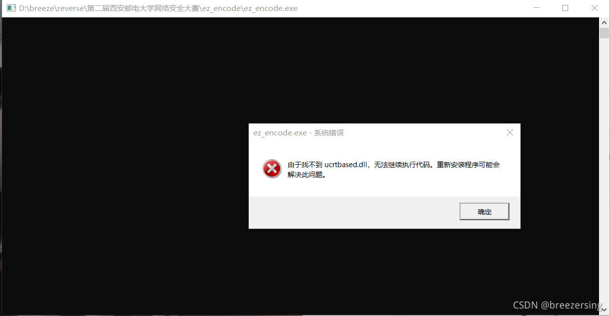
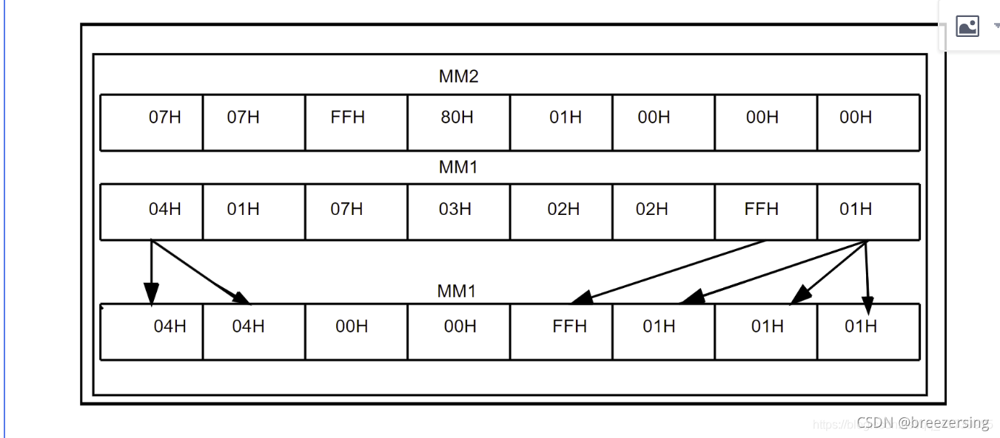
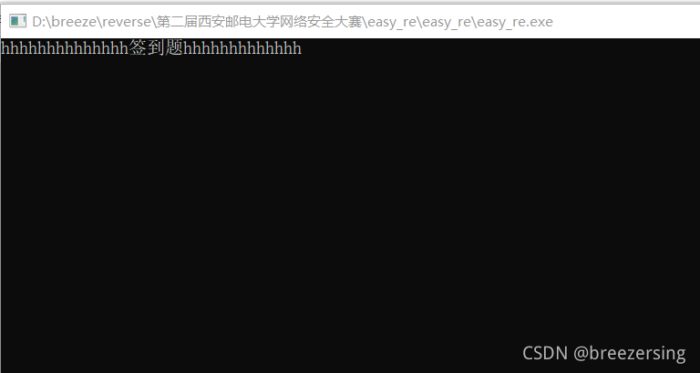
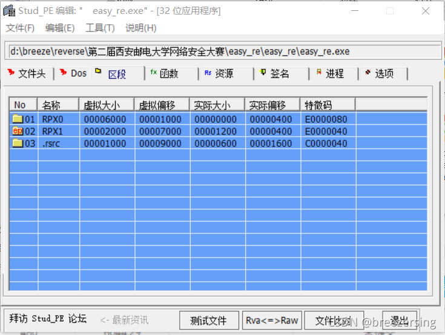
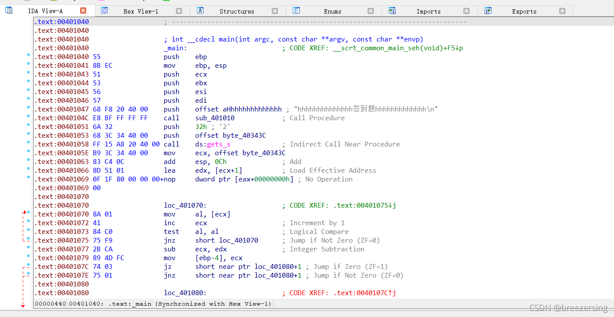
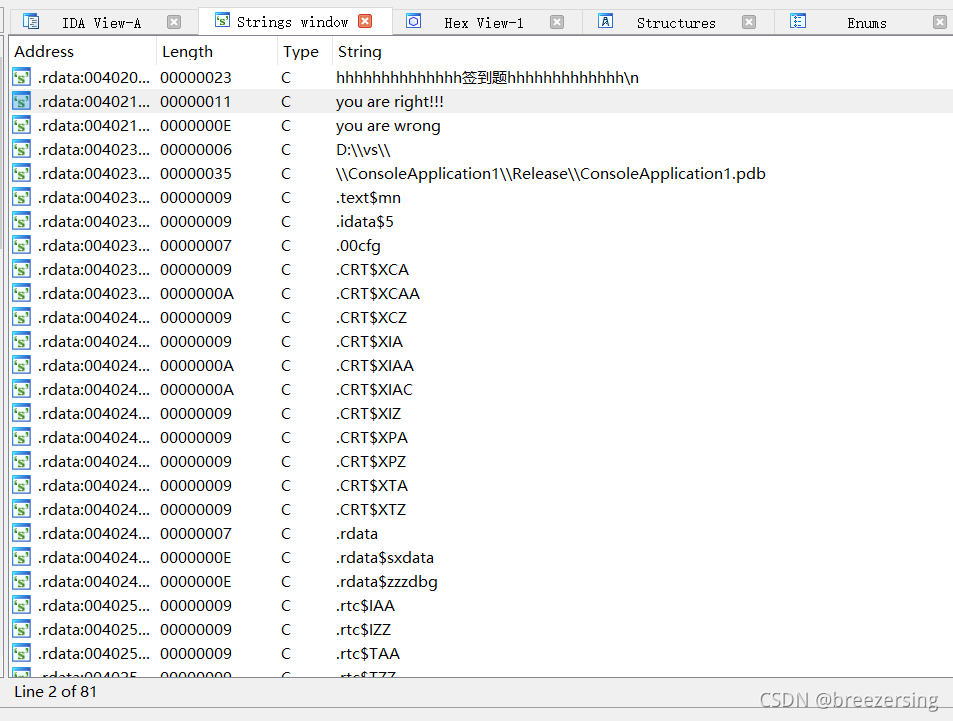
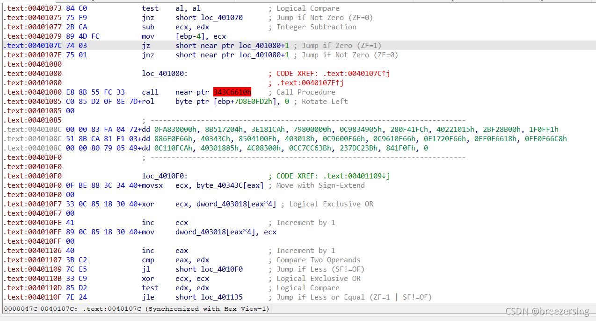
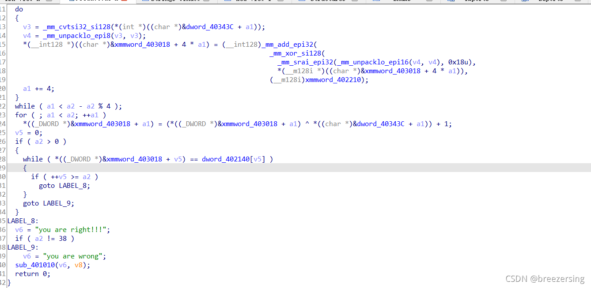

# ez_MATH

下载文件后打开：

```cpp
#include<stdio.h>
#include<string.h>
int main()
{
	//welcome to XUPT_CTF!
	//在CTF逆向中，首先需要建立起逆向思维，希望本次CTF校赛能够给你带来一些收获！
	char flag[] = "xxx";
	for (int i = 0; i < strlen(flag); i++)
	{
		//printf("%c", flag[i]);
		flag[i] -= 5;
		flag[i] += 2;
		flag[i] -= 1;
		flag[i] ^= 5;
		flag[i] += 2;
		flag[i] = (flag[i] + 1);
		printf("%d,", flag[i]);
	}
}
//encodeflag = {106, 112, 91, 105, 117, 79, 91, 120, 100, 97, 67, 109, 97, 71, 71, 71, 91, 109, 115, 127}
```

提示加密后的flag为：

```cpp
encodeflag = {106, 112, 91, 105, 117, 79, 91, 120, 100, 97, 67, 109, 97, 71, 71, 71, 91, 109, 115, 127}
```

经过逆推后的代码是：

```cpp
int s[] = {106, 112, 91, 105, 117, 79, 91, 120, 100, 97, 67, 109, 97, 71, 71, 71, 91, 109, 115, 127};
int main(void){
	for (int i = 0; i < 20; i++)
	{
		s[i]--;
		s[i]-=2;
		s[i]^=5;
		s[i]+=1;
		s[i]-=2;
		s[i]+=5;
		printf("%c",s[i]);
	}
} 
```

# eazy_encode

下载后打开程序：




发现缺少两个dll文件,没关系，网上搜索直接下载，放入与exe文件同一个文件夹中。之后程序就能运行了：


通过peid检查文件信息，包括文件是否加壳，文件是32位还是64位。


发现是未加壳的32位文件，放入ida中。F5找到main函数：


能知道str2的内容。需要知道str1的内容，显然str1和v10有关，而v10就是flag，发现sub_411294这个函数比较重要。点开后：


能看出来这是base64加密。

将[nyi[4ujZYOmOkSgcn:1Y4KmenWzd3W:所有字母减一后base64解码后就能获得flag。

# easy_re

解压后两个文件：


zip文件打不开有密码，显然key是他的密码。打开key：

```bash
BITS 64
global check
section .text
check:
    mov rbp, rsp
    sub rsp, 0x100
    VMOVDQA ymm0, [rdi]
    and rsp, 0xffffffffffffff00
    mov rax, 0xfeca50051345b0b0
    push rax
    push rax
    push rax
    push rax
    VMOVDQA ymm1, [rsp]
    VPXOR ymm2, ymm1, ymm0
    mov rax, 0x0100030205040706
    push rax
    mov rax, 0x09080b0a0c0d0f0e
    push rax
    mov rax, 0x1110131215141716
    push rax
    mov rax, 0x19181b1a1c1d1f1e
    push rax
    VMOVDQA ymm3, [rsp]
    VPSHUFB ymm4, ymm2, ymm3
    mov rax, 0xd1d3762335619aab
    push rax
    mov rax, 0xd5d52327356583f8
    push rax
    mov rax, 0xdcd67424217e9bbd
    push rax
    mov rax,0xd5d622713161cbf8 
    push rax
    VMOVDQA ymm0, [rsp]
    VPCMPEQQ  ymm1, ymm4, ymm0
    VMOVDQA [rsp], ymm1
    pop rax
    cmp rax, 0xffffffffffffffff
    jnz fail
    pop rax
    cmp rax, 0xffffffffffffffff
    jnz fail
    pop rax
    cmp rax, 0xffffffffffffffff
    jnz fail
    pop rax
    cmp rax, 0xffffffffffffffff
    jnz fail
    mov rax, 1
    jmp fin
fail:
    xor rax, rax
fin:
    mov rsp, rbp
    ret
```

读代码知，key实际上是[rdi]，这个程序先把rdi与rax异或，然后用VPSHUFB调整代码顺序，最后一个比较跳转到fin

主要是VPSHUFB这条指令的学习 通过百度了解到




这两幅图可以让我们清楚的学会这条指令 ，然后就可以在纸上画出正确的值（一共就四条，不写脚本了）

拿到四个正确的值后 一个异或即可拿到key

```python
e=0xfeca50051345b0b0

a=0xcbf861312271d5d6
b=0x9bbd217e7424dcd6
c=0x83f865352327d5d5 
d=0x9aab35617623d1d3

a=a^e
b=b^e
c=c^e
d=d^e
print(hex(a)[2:]+hex(b)[2:]+hex(c)[2:]+hex(d)[2:])
print(hex(a)[2:],hex(b)[2:],hex(c)[2:],hex(d)[2:])
```

用key解压easy_re.zip文件。打开后：



用peid查看发现是upx加壳的32位文件。

然后脱壳处理，初次使用upx脱壳工具会发现无法脱壳，原因是upx加密后进行了防解密的修饰。

用Stud_PE修改区段名



将区段名的R都改为U，这样就能用upx工具脱壳了。

脱壳后的文件放入ida中：



通过shift+F12获取字符串



发现you are right  you are wrong

点击跳转到字符串位置，向上翻找到：



选定后按d 和p后就可以按F5

获得函数：




知道了xmmword_403018和dword_402140获得dword_40343c

通过下面代码获得flag。

```cpp
#include <stdio.h>
int s[] = {103, 110, 100, 101, 128, 55, 49, 63, 58, 59, 59, 52, 107, 64, 112, 60, 116, 36, 117, 38, 46, 46, 38, 114, 43, 34, 35, 44, 121, 47, 45, 123, 19, 25, 66, 28, 17, 89};
int m[] = {0, 1, 2, 3, 4, 5, 6, 7, 8, 9, 10, 11, 12, 13, 14, 15, 16, 17, 18, 19, 20, 21, 22, 23, 24, 25, 26, 27, 28, 29, 30, 31, 32, 33, 34, 35, 36,37};
int main(void) {
    for(int i=0;i<38;i++)
        printf("%c",(s[i]-1)^m[i]);
}
```