# VScode 配置

## B站视频

[从零开始手把手教你配置属于你的VS Code](https://www.bilibili.com/video/BV1TT4y1g7aF?spm_id_from=333.999.0.0&vd_source=c7f0a8a1b453261561b18cd69cebd8b3)

## 资源

**mingw64：**[百度网盘链接](https://pan.baidu.com/s/1L8OdqC-4VIfRvU0_cWa4jw?pwd=4i7v)

**VS Code下载地址：**[VS Code官网](https://code.visualstudio.com/)

## mingw64

将资源中的mingw64下载后放到合适的位置，然后将文件路径加入到环境变量中

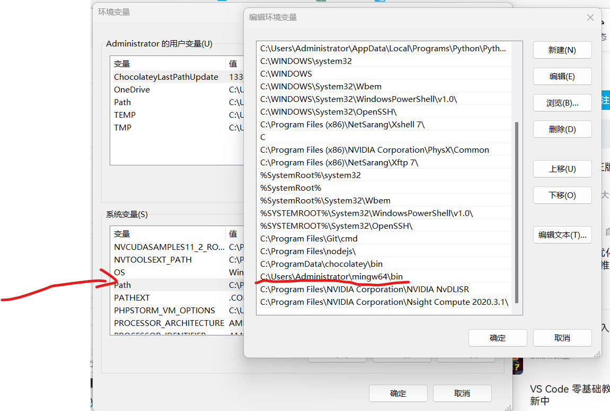

## VScode扩展下载

C/C++：运行C和C++的软件

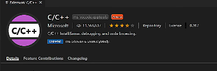

Chinese (Simplified) (简体中文) Language Pack for Visual Studio Code：汉化软件

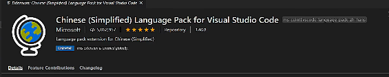

Code Runner：代码运行软件

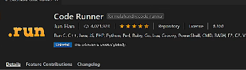

Git Graph：git版本控制查看软件

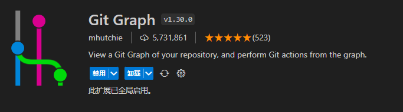

## Code Runner 配置

打开扩展设置

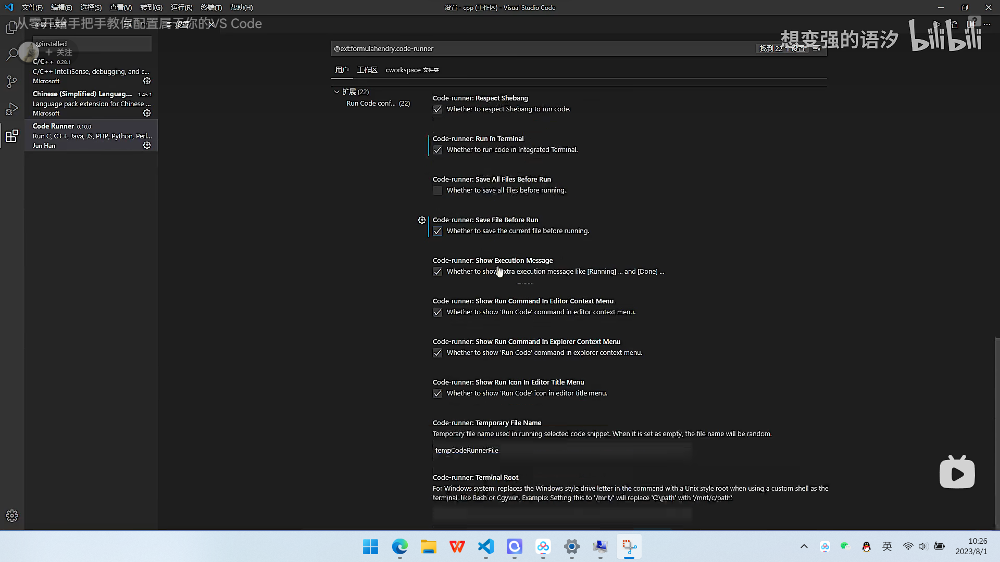

## C/C++ 配置

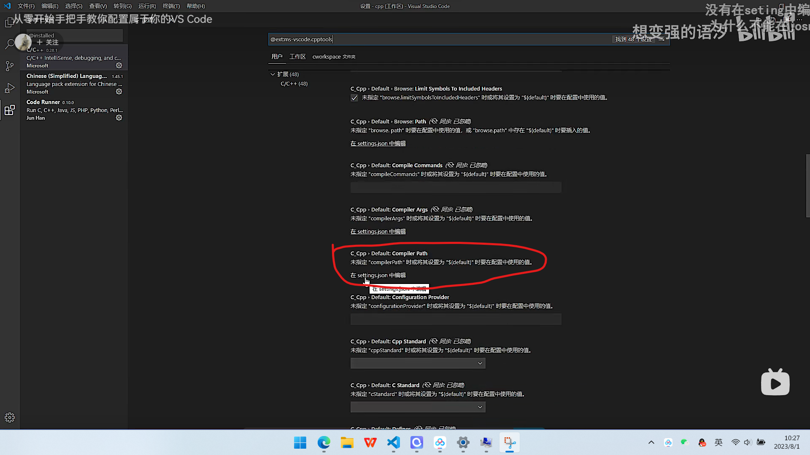

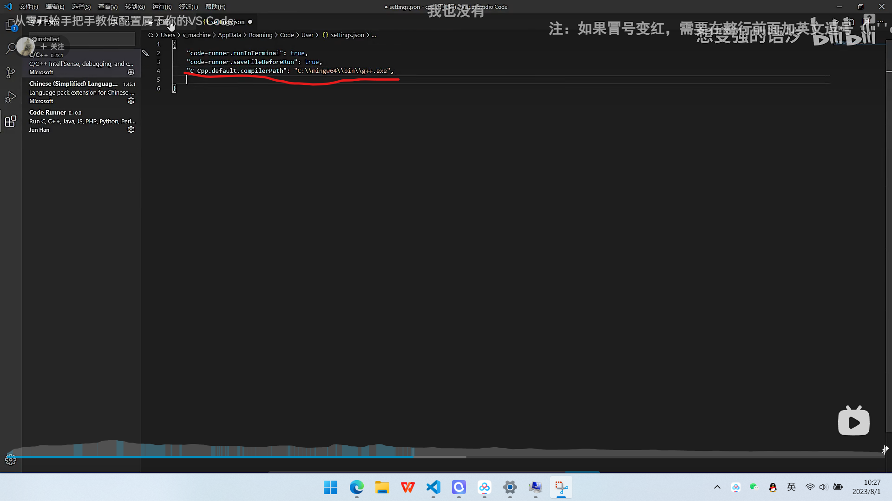

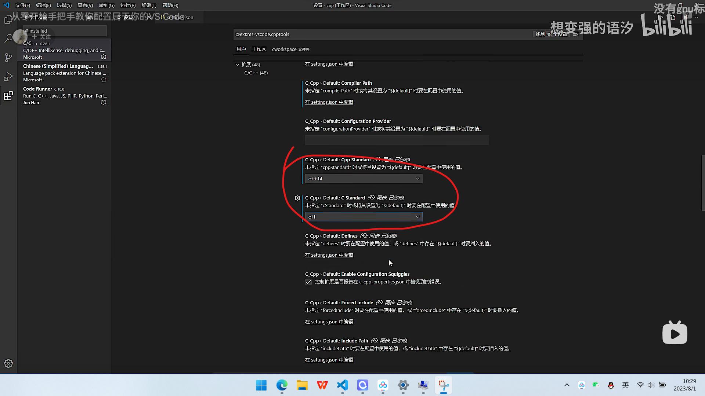

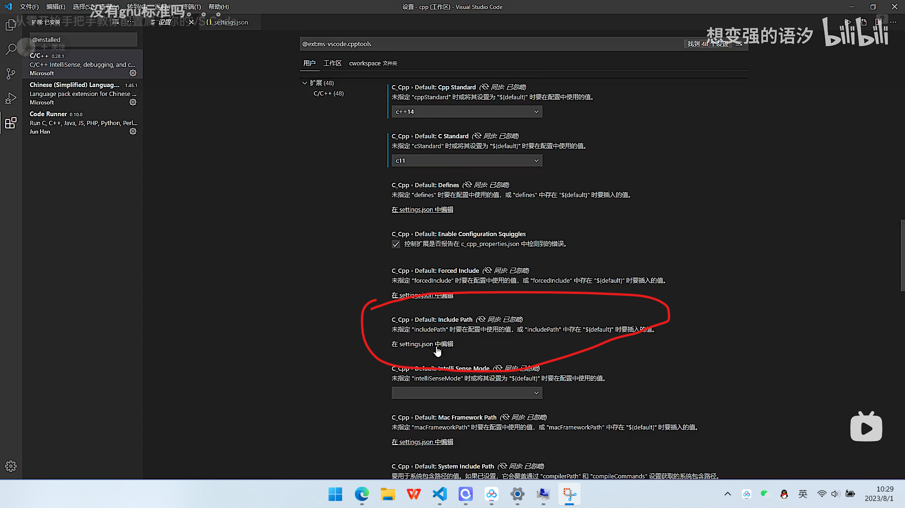

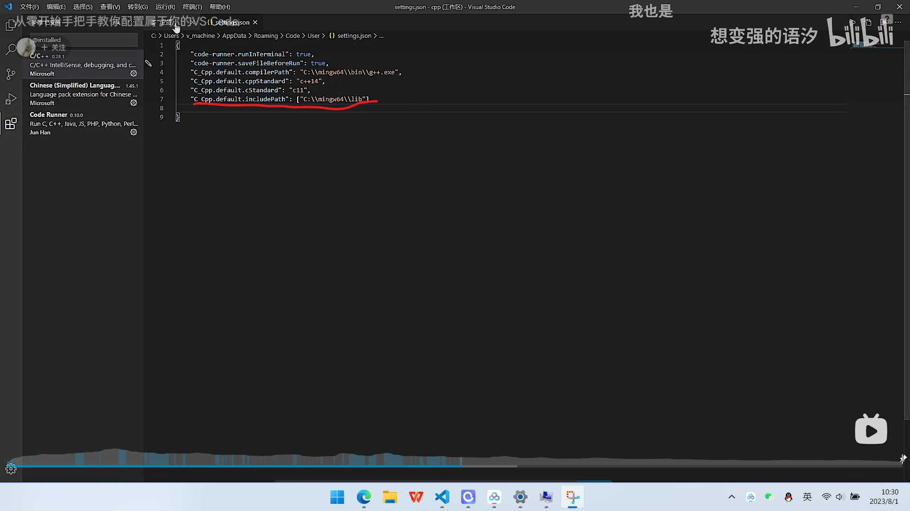

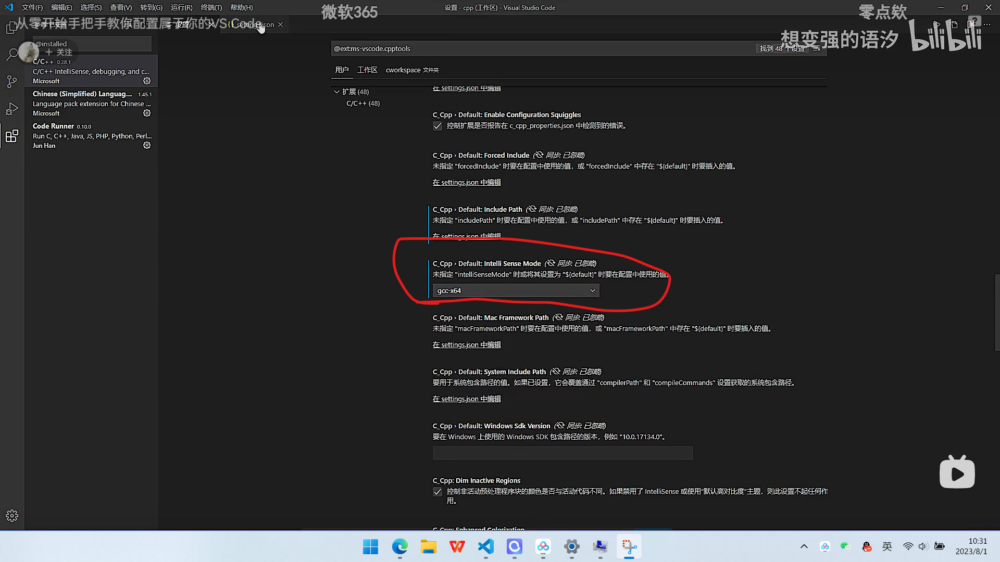

# VScode 代码片段

用好了就是非常好用的快捷键

```json
"Print to console": {
    "prefix": "log",
 	  "body": [
 		  "console.log('$1');",
 		  "$2"
 	  ],
 	  "description": "Log output to console"
 }
```