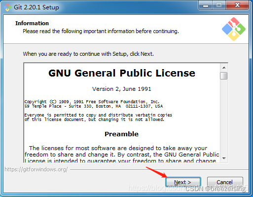
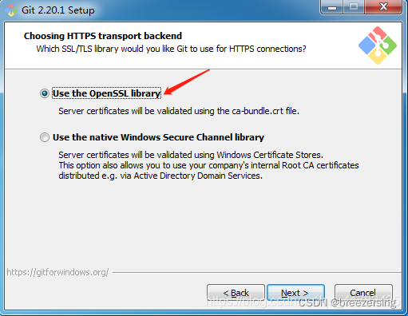
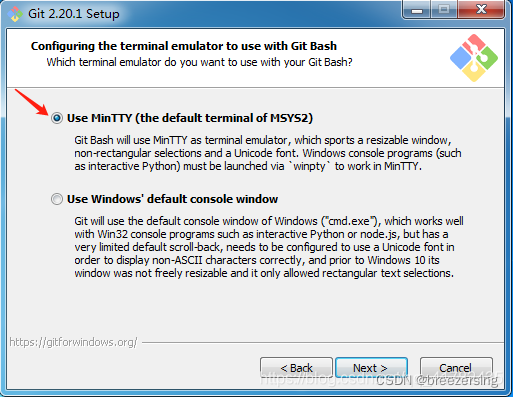
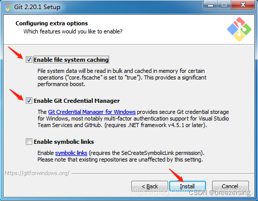
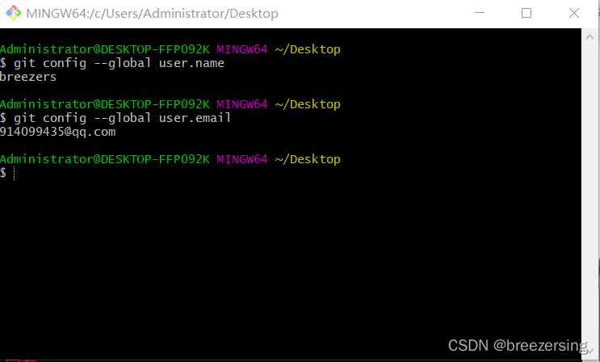
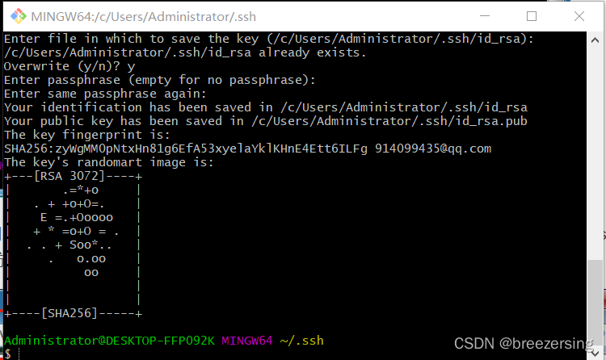
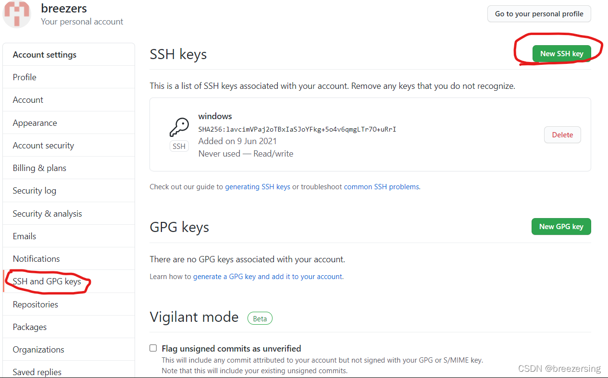
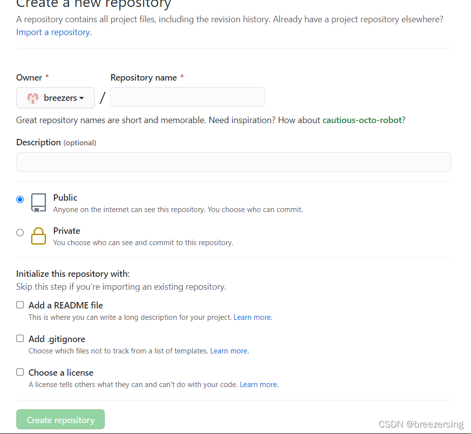

# 安装git

[git下载地址](https://git-scm.com/downloads)

点开后如下图：


设置跟随下图













# 配置git

单机右键，打开Git Bush Here然后通过输入命令设置用户名。

```bash
# 配置用户名
git config --global user.name "Github的用户名"      
# 配置用户邮箱
git config --global user.email "GitHub的绑定邮箱"   
# 查看用户名
git config --global user.name                      
# 查看用户邮箱
git config --global user.email                     
```



通过命令生成SSH Key

```bash
cd ~/.ssh
# 生成SSH
ssh-keygen -t rsa -C "Githum的绑定邮箱"     
```

然后都敲回车，生成下图则成功。



创建完成后，在用户主目录里找到.ssh目录，里面有id_rsa和id_rsa.pub两个文件，这两个就是SSH Key的秘钥对，id_rsa是私钥，不能泄露出去，id_rsa.pub是公钥，可以放心地告诉任何人


将公钥添加到GitHub的SSH Keys中



# git链接仓库

在GitHub中新建仓库。



复制http网址

在本地新建文件夹，这个文件夹将成为与GitHub链接的文件夹。在文件夹中依次输入如下命令

```bash
# 如果链接存在内容的仓库
git clone "GitHub之前复制的网址"
# 创建git
git init
# 保存GitHub网址
git remote add origin "GitHub之前复制的网址"
# 从GitHub中拉取文件覆盖本地文件夹
git pull origin master
# 保存本地更改
git stash
# 查看本地分支
git branch
# 在本地新建分支
git branch "分支名"
# 切换本地分支
git checkout "分支名"
# 删除本地分支
git branch -d "分支名"
# 将文件放入缓存区
git add "文件名"
# 将本地的所有文件放入缓存区
git add .
# 为放入缓存中的文件添加说明
git commit -m "注释"
# 将缓存中的文件上传到GitHub
git push origin master
```

**以上就是git链接仓库的方法**

**git 代理设置命令**

```bash
# 设置代理http
git config --global http.proxy http://127.0.0.1:8889
# 设置代理https
git config --global https.proxy https://127.0.0.1:8889
# 取消代理http
git config --global --unset http.proxy
# 取消代理https
git config --global --unset https.proxy
# 查看git配置
git config -l --global
```

# git上传的一些问题

在git上传时，有时会遇到报错。

>fatal: unable to access 'https://github.com/jack-tan2/git_test.git/': gnutls_handshake() failed: Error in the pull function.

这一种错误是因为你网络与 github 通信不好，需要挂代理

>fatal: unable to access 'https://github.com/jack-tan2/git_test.git/': Failed to connect to 127.0.0.1 port 1080: Connection refused

这一种错误是因为你已经设置了代理的主机号和端口，但是并没有将对应的代理打开 (如 v2ray 之类的代理软件)，下面来详细讨对 git 代理设置的问题

# git的代理设置

经常设置代理的同学可能会遇到 git 无法工作的情况，问题分为 git 自身问题和非 git 自身的外部原因

**自身问题** 是由于 git 可以用命令给自身设置局部代理，而且通过命令产生的相关设置在关闭终端后仍然生效 (通常使用命令的设置是临时的，重启终端后就失效了)

如果你设置错了代理，将代理设置成 http://127.0.0.1:8889，但是你打开的 http 类型的代理软件的主机号和端口是 http://127.0.0.1:1010，这样端口不一样的话，git 就不会工作，就算你重新打开终端 git 也一样连不上，所以由于某个时刻操作上的失误以及失误后遗忘了这个错误操作，就会导致 git 一直都无法正常与远程仓库连接

**外部原因** 原因应该很多，我遇到的一种情况就是你将自己的电脑重启后会发现浏览器上不了网了，浏览器是走 http/https 的，而我的 git 用的也是 http/https，所以 git 也无法与远程仓库连接了。这种情况是因为重启了，你的代理软件已经关闭，但是相关的代理设置并没有关闭，这个时候你需要取消这些设置。

**使用 git 命令给 git 设置代理**

使用 config 子命令为 git 单独设置代理

```bash
git config --global http.proxy http://127.0.0.1:8889
git config --global https.proxy https://127.0.0.1:8889
```

设置完了之后我们用 git config -l --global 查看 git 的配置，输出如下：

```bash
# 我们之前输入的邮箱也被  git 保存了
user.email=you@example.com 
# 我们之前输入的用户名也被  git 保存了
user.name=Your Name	
http.proxy=http://127.0.0.1:8889
https.proxy=https://127.0.0.1:8889
```

可以看到 git 的 http/https 的代理已经成功被设置

要注意 http://127.0.0.1: 后面的端口号必须与你的代理软件的 http/https 的端口一致，否则就会出现以下的错误：

>fatal: unable to access 'https://github.com/jack-tan2/git_test.git/': Failed to connect to 127.0.0.1 port 1080: Connection refused

而且还要注意的事情就是，你把代理客户端软件关了之后，git 就连不上了，**因为你输入了上面两条命令之后，git 会直接将这个两个配置写入配置文件**，会永远生效，这就和 bash 不一样，bash 在命令行中设置的是临时的，你重新打开，之前的配置就会失效，这样使得 git 会一直通过代理服务器来与远程服务器进行连接，可此时 https://127.0.0.1:8889 的代理已经关闭，自然无法连接，这个时候我们就要使用 config 子命令的 --unset 选项来取消：

```bash
git config --global --unset http.proxy
git config --global --unset https.proxy
```

设置完了之后我们 git config -l --global 查看 git 的配置，输出如下：

```bash
user.email=you@example.com
user.name=Your Name
```

可以看到代理设置已经消失，这个时候就可以在代理客服端软件关闭的时候使用 git 连接远程仓库了。

**使用代理客户端软件，自动为整个系统设置代理**

只要打开了代理软件，成功能连上网，git 也就相当于走了代理，关闭了代理软件，也就相当于 git 关闭了软件，这个就比 1. 中 git 代理的手动设置要方便的多