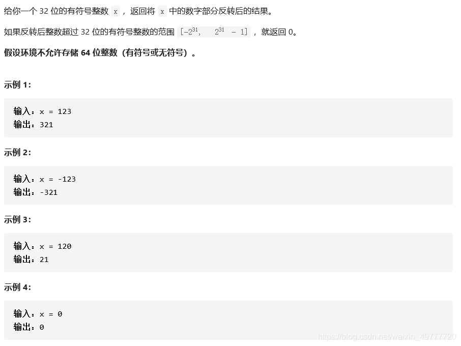
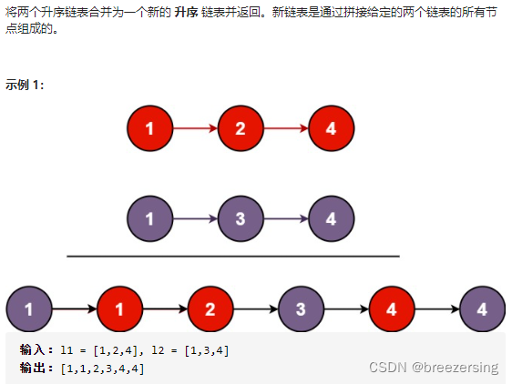
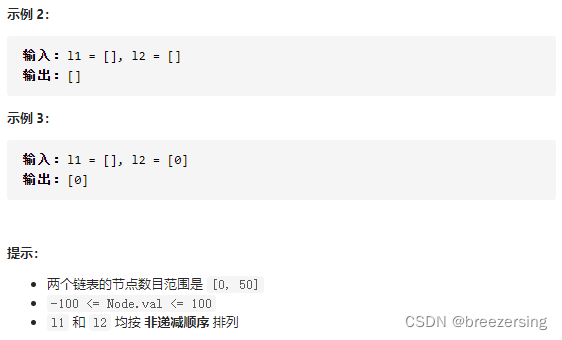
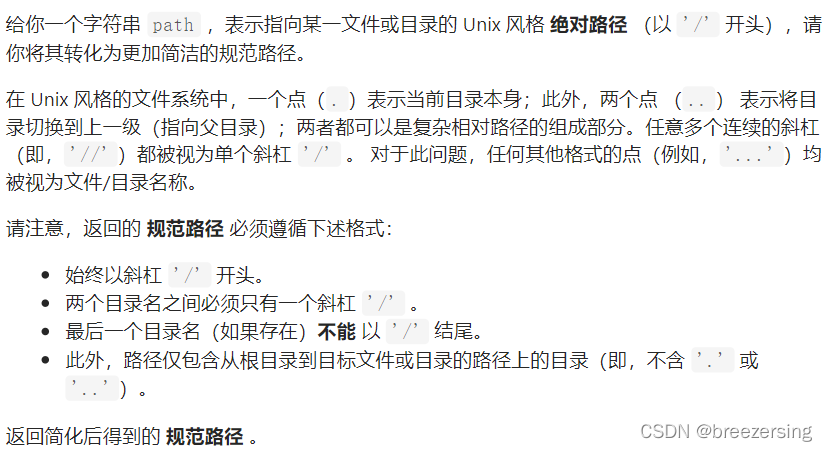
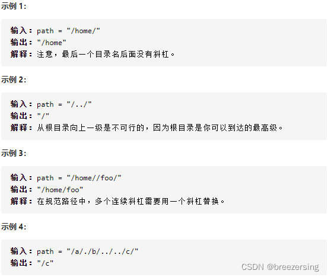

# 整数反转



**我的思路**：将int数字转化为字符串，再将字符串逆序，最后将字符串转化为数字。

```cpp
#include<iostream>
#include<sstream>
#include<string>
using namespace std;
class Solution {
public:
    int reverse(int x) {
        string str,s;
        stringstream a;
        long long y;
        a << x;
        a >> s;
        for (auto i = s.end()-1; i != s.begin(); i--) {
            str.push_back(*i);
        }
        if (*s.begin() < '0' || *s.begin() > '9') {
            str.insert(str.begin(), 1, *s.begin());
        }
        else
            str.push_back(*s.begin());
        a << str;
        a >> y;
        if (y < -2147483648 || y>2147483647)
            return 0;
        else
            return y;
    }
};
int main(void) {
    Solution a;
    cout << a.reverse(1534236469) << endl;
}
```

这里用到了新的知识点：通过流改变字符性质。

```cpp
#include<iostream>
#include<sstream>
#include<string>
using namespace std;
int main(void) {
	stringstream str_stream;
	string str("685");
	str_stream << str;
	int num;
	str_stream >> num;
	cout << num;
	return 0;
}
```

这里将字符串685，通过流变为数字685。

# 合并有序链表





这道题用的是递推算法，我一开始的想法是先将两条链表通过递推延伸到末尾，然后再反向递推得出新链表。在这个方法中，递推分为了四种情况，即l1，l2都为nullptr，其中一个是nullptr，两个都不是nullptr，但再返回时由于不能确定返回过程与递推过程是否相符因此失败了。
采用新思路。既然从后往前不行，那就从前往后，判断两条链的头谁最小，将小的取出放到新链表中去。代码如下：

```cpp
/**
 * Definition for singly-linked list.
 * struct ListNode {
 *     int val;
 *     ListNode *next;
 *     ListNode() : val(0), next(nullptr) {}
 *     ListNode(int x) : val(x), next(nullptr) {}
 *     ListNode(int x, ListNode *next) : val(x), next(next) {}
 * };
 */
class Solution {
public:
    ListNode* mergeTwoLists(ListNode* l1, ListNode* l2) {
         if(l1 == nullptr && l2 == nullptr) {
            return nullptr;
        }
        else if(l1 == nullptr)
            return l2;
        else if(l2 == nullptr)
            return l1;
        else if(l1->next==nullptr&&l1->val<=l2->val){
                l1->next=l2;
                return l1;
        }
        else if(l2->next==nullptr&&l1->val>l2->val){
            l2->next=l1;
            return l2;
        }
        else if(l1->val<=l2->val){
            l1->next=mergeTwoLists(l1->next,l2);
            return l1;
        }
        else{
            l2->next=mergeTwoLists(l1,l2->next);
            return l2;
        }
    }
};
```

# 简化路径






思路：以“/”为分界线将path分为多段，判断每段的内容是否是“.” “..”，再根据内容分别处理。

```cpp
#include <deque>
#include <string>
using namespace std;
class Solution {
public:
    string simplifyPath(string path) {
        deque<string> str;
        int a = 0, b = 0;
        while((a = path.find_first_not_of("/", b)) != -1) {
            b = path.find_first_of("/", a);
            string strs;
            if(b == -1)
                strs.assign(path.begin() + a, path.end());
            else
                strs.assign(path.begin() + a, path.begin() + b);
            if(strs == ".")
                continue;
            else if(strs == ".." && !str.empty())
                str.pop_back();
            else if(strs == ".." && str.empty())
                continue;
            else
                str.push_back(strs);
        }
        string st;
        while(!str.empty()) {
            st += "/";
            st += str.front();
            str.pop_front();
        }
        if(st.empty())
            st.push_back('/');
        return st;
    }
};
int main(void) {
    Solution a;
    a.simplifyPath("/a//b////c/d//././/..");
}
```