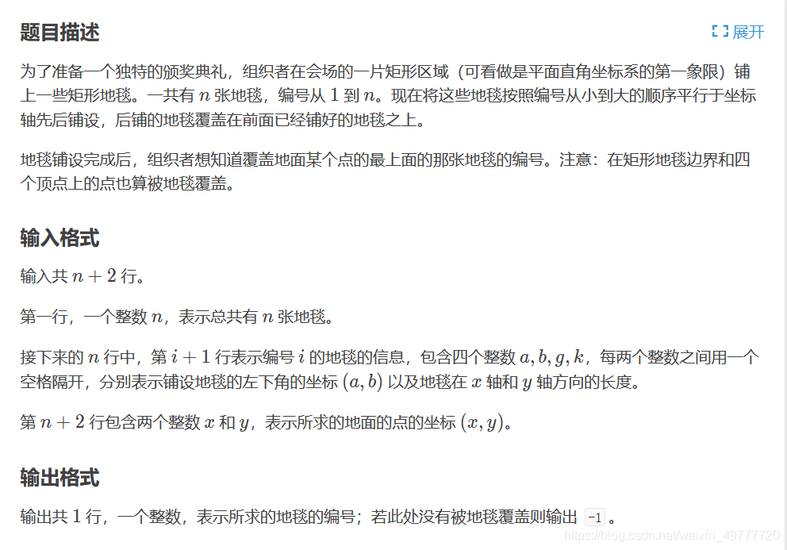
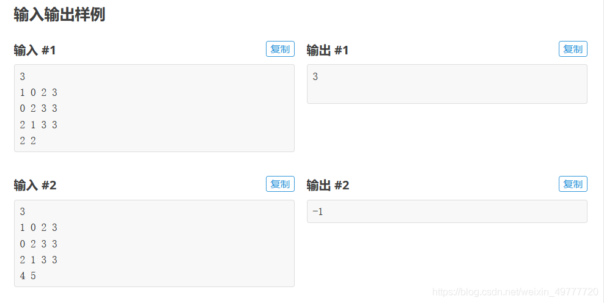
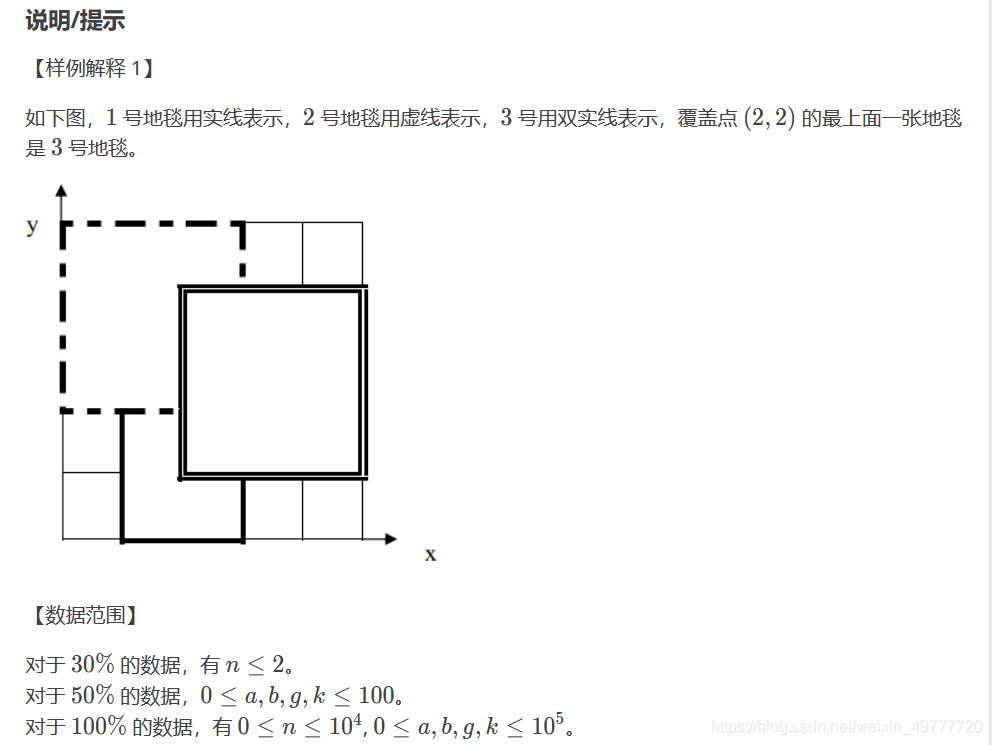
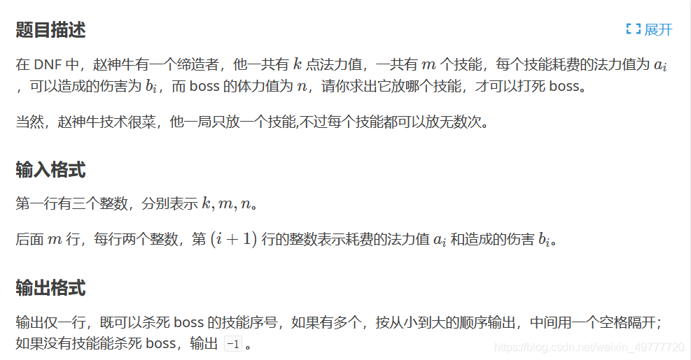
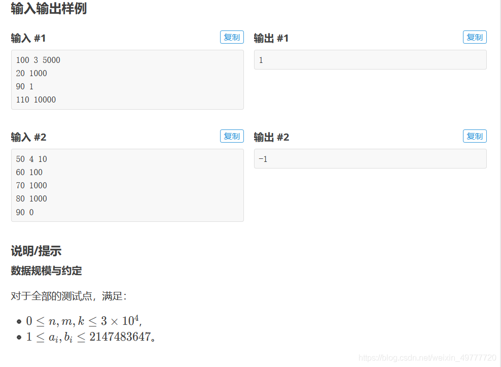
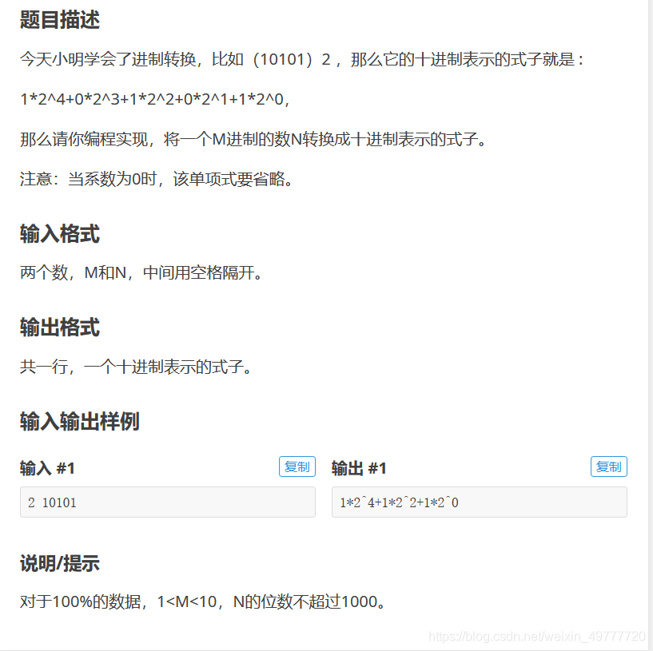

# P1003铺地毯







```c
#include<stdio.h>
#include<string.h>
#include<stdlib.h>

int main(void)
{
	int n,i,j=0,x,y;
	struct{
		int a;
		int b;
		int g;
		int k;
	}dt[10001];
	scanf("%d",&n);
	for(i=1;i<=n;i++)
		scanf("%d %d %d %d",&dt[i].a,&dt[i].b,&dt[i].g,&dt[i].k);
	scanf("%d %d",&x,&y);
	for(i=n;i>0;i--)
		if(x>=dt[i].a&&x<=dt[i].a+dt[i].g&&y>=dt[i].b&&y<=dt[i].b+dt[i].k)
		{
			j++;
			break;
		}
	if(j!=0)
		printf("%d",i);
	else
		printf("-1");
	
	return 0;
}
```

# P2006赵神牛的游戏





```c
#define _CRT_SECURE_NO_WARNINGS
//赵神牛的游戏
#include<stdio.h>
#include<stdlib.h>
int main(void) {
    int k, m, n;
    int i, t = 0;
    int a, b;
    scanf("%d%d%d", &k, &m, &n);
    for (i = 0; i < m; i++) {
        scanf("%d%d", &a, &b);
        if (a == 0 && b > 0) {
            printf("%d ", i + 1);
            t = 1;
        }
        else if (k / a * b >= n) {
            printf("%d ", i + 1);
            t = 1;
        }
    }
    if (t == 0)printf("%d ", -1);

    return 0;
}
```

# P2084进制转换



```c
#define _CRT_SECURE_NO_WARNINGS
//进制转换
#include<stdio.h>
#include<stdlib.h>
#include<string.h>

int main(void) {
	int m,i,l,j,t;
	char n[1000];
	scanf("%d", &m);
	scanf("%s", n);
	l = strlen(n);
	for (i = 0; i < l; i++) {
		t = 0;
		if (n[i] != '0') {
			for (j = i + 1; j < l; j++)
				if (n[j] != '0') { 
					 printf("%c*%d^%d+", n[i], m, l - i - 1);
					 t = 1;
					 break;
				}
			if (t == 0)printf("%c*%d^%d", n[i], m, l - i - 1);
		}
	}
}
```