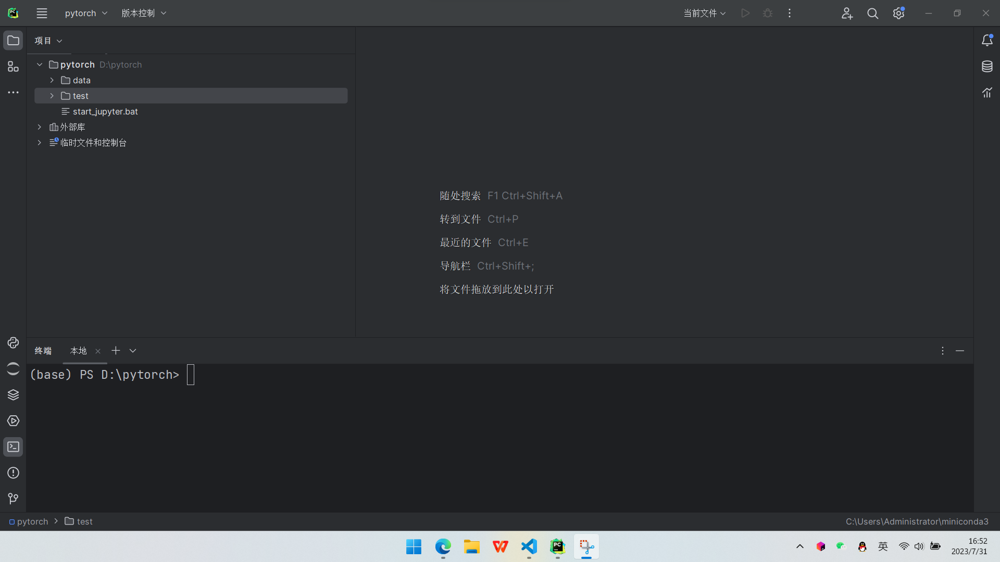
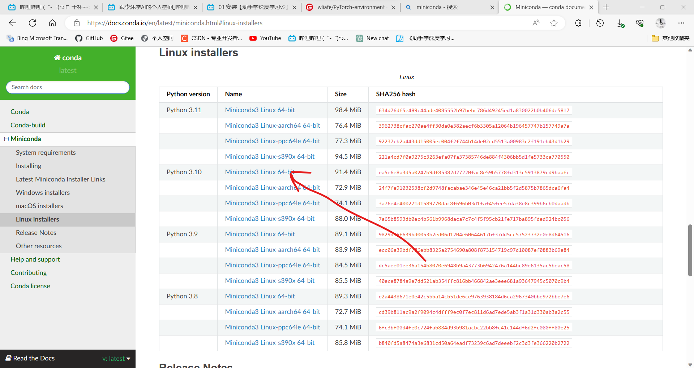

# 机器学习PyTorch环境配置

## Windows环境

### 下载Miniconda

从[Conda官网](https://docs.conda.io/en/latest/miniconda.html#windows-installers)下载合适的Miniconda环境，然后安装环境。

### 利用pycharm启动Miniconda环境



### 安装基本工具

```shell
pip install jupyter torch torchvision
```

### Windows启动jupyter脚本

创建文本文件，将下述脚本复制进去，改为start_jupyter.bat文件,双击即可启动jupyter记事本

```bat
@echo off

:: 设置Miniconda路径
set conda_path=C:\Users\Administrator\miniconda3

:: 检查Miniconda是否已安装
if not exist "%conda_path%" (
    echo Miniconda未找到，请先安装Miniconda并设置正确的路径。
    pause
    exit /b
)

:: 激活Miniconda环境
call "%conda_path%\Scripts\activate.bat"

:: 启动Jupyter
start "" "%conda_path%\Scripts\jupyter-notebook.exe"

:: 退出Miniconda环境
call conda deactivate
```

## Linux环境

我用的是Ubuntu环境

### 安装python3

```shell
apt install python3.10
```

### 安装Miniconda

从[Conda官网](https://docs.conda.io/en/latest/miniconda.html#linux-installers)获取网址



通过wget获取shell脚本，运行shell脚本

```
wget https://repo.anaconda.com/miniconda/Miniconda3-py310_23.5.2-0-Linux-x86_64.sh
```

### 安装基本工具

```shell
pip install jupyter torch torchvision
```

### shell脚本

为方便配置Linux环境，我编写了一个shell脚本，脚本仓库为[pytorch-environment](https://gitee.com/wliafe/pytorch-environment.git)

下面是脚本内容，仅供参考。

```shell
#!/bin/bash

# 检查当前用户是否为root
if [[ $EUID -ne 0 ]]; then
    echo "当前用户不是root用户，正在获取sudo权限。"
    if ! command -v sudo >/dev/null 2>&1; then
        echo "sudo命令未找到，请确保安装了sudo工具。"
        exit 1
    fi
    sudo_cmd="sudo"
else
    echo "当前用户是root用户。"
    sudo_cmd=""
fi

$sudo_cmd apt update

if command -v python3.10 &>/dev/null; then
    echo "python3.10已安装"
else
    echo "安装python3.10"
    $sudo_cmd apt install python3.10
    echo "python3.10安装成功"
fi

if command -v conda >/dev/null 2>&1; then
    echo "Miniconda已安装。"
else
    echo "安装Miniconda。"
    wget https://repo.anaconda.com/miniconda/Miniconda3-py310_23.5.2-0-Linux-x86_64.sh
    echo -e "\nyes\n\nyes" | bash Miniconda3-py310_23.5.2-0-Linux-x86_64.sh
    rm Miniconda3-py310_23.5.2-0-Linux-x86_64.sh
    echo "Miniconda安装成功。"
fi

echo "退出终端，重新进入终端后再次运行这个脚本。"
pip install jupyter torch torchvision
```