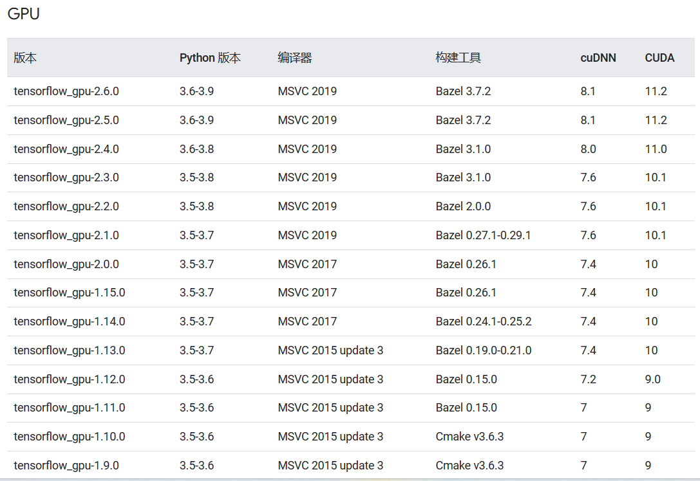
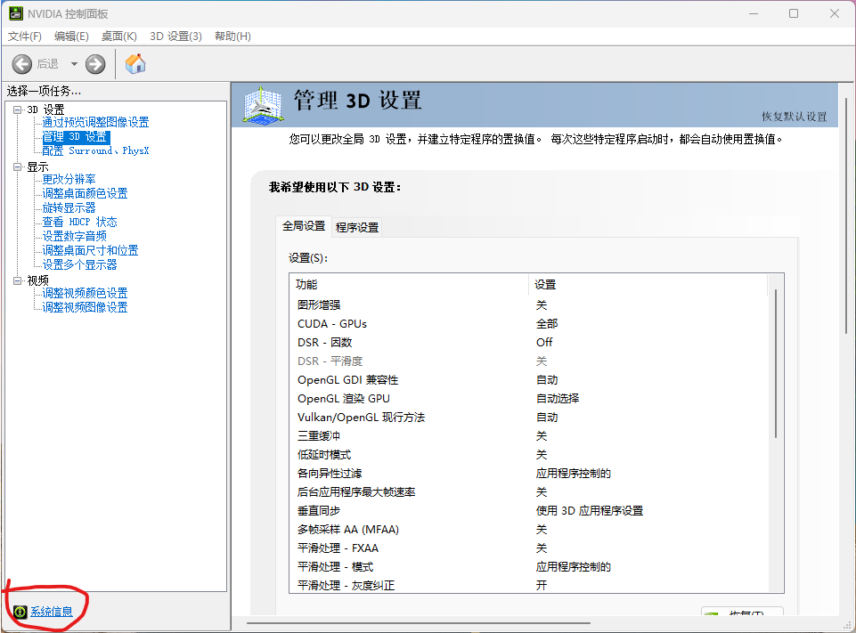
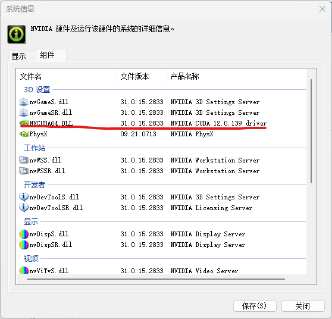
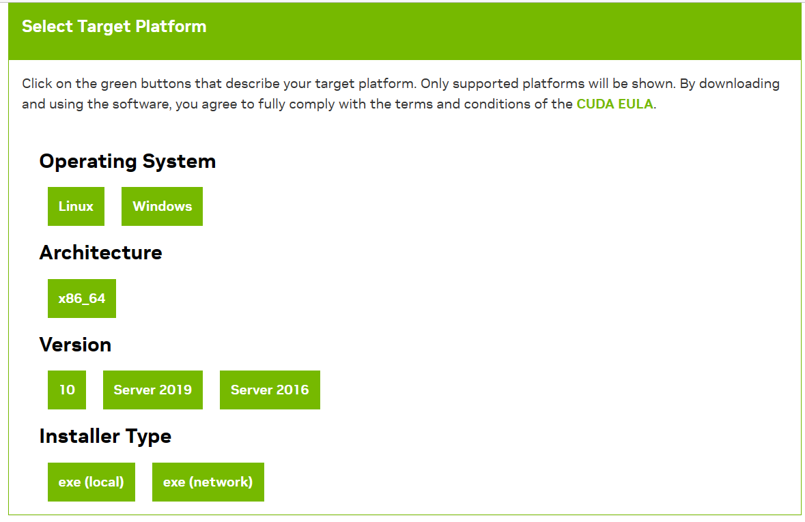

# 确定CUDA和cudnn版本

这里我是要用TensorFlow这个python库运行机器学习代码，因此要根据TensorFlow来配置CUDA和cudnn

查看[TensorFlow官网](https://tensorflow.google.cn/install/source_windows?hl=zh-cn#gpu)，选择合适的版本方案

# 安装CUDA

打开NVDIA控制面板，点击左下角系统信息，然后点击组件

这里的12.0是指cuda的最高版本，较低的版本也可以用，具体需要上网搜索和尝试。

登录官网，下载合适的CUDA

[官网下载地址](https://developer.nvidia.com/cuda-toolkit-archive)

下载完后点击安装即可，选择精简安装一路next

# 安装cudnn

[官网下载cudnn](https://developer.nvidia.com/rdp/cudnn-archive)

选择与CUDA对应的cudnn版本下载

将下载好的cudnn中的文件解压到cuda的安装目录下，GPU环境就配置好了

接下来只需在conda环境中下载相应的TensorFlow版本就可以使用GPU运行机器学习程序了