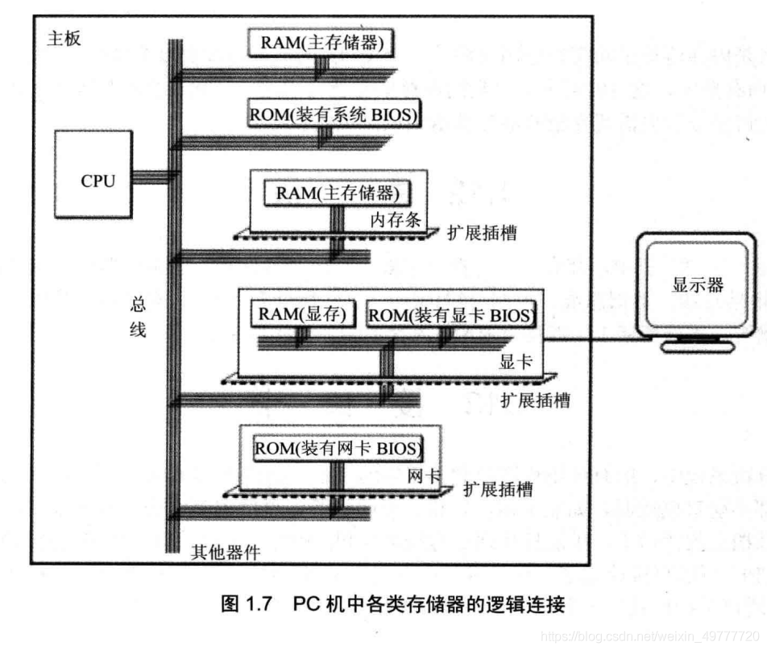
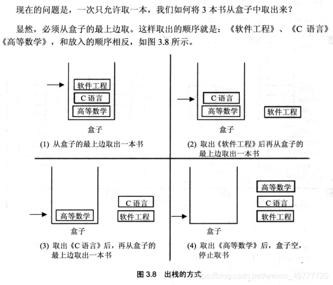
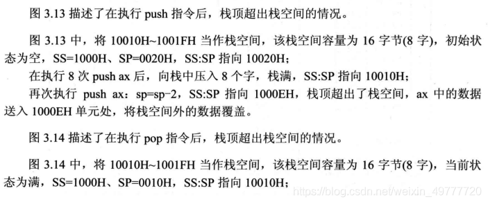
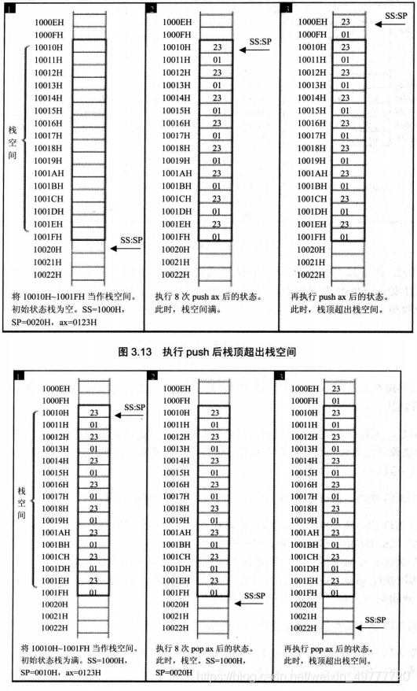

# 汇编语言的组成

汇编语言有3类指令组成。

 - 汇编指令：机器码的助记符，有对应的机器码。

 - 伪指令：没有对应的机器码，由编译器执行，计算机并不执行。

 - 其他符号：如+、-、*、/等，由编译器识别，没有对应的机器码。

# CPU 对存储器的读写

cpu 需对外部器件进行下面3类信息交互。

 - 存储单元的地址（地址信息）

 - 器件的选择，读或写的命令（控制信息）

 - 读或写的数据（数据信息）

# 各类存储器芯片

随机存储器（RAM）：可读可写，必须带点存储，断电内容丢失。

只读存储器（ROM）：只读不写。

# 内存地址空间

这里以8086PC机内存地址空间分配为例

这幅图意思是从地址0 9FFFF的内存单元中读取数据，实际上是读取主随机存储器中的数据；向地址A0000 BFFFF的内存单元中写数据，就是向显存中写数据，这些数据会被显卡输出到显示器上；我们向地址C0000 BFFFF 的内存单元中写数据的操作是无效的，因为这等于改写只读存储器中的内容。

# 8086CPU给出物理地址方法

物理地址=段地址*16+偏移地址

基础地址=段地址*16

物理地址=基础地址+偏移地址

8086CPU读取信息位置=CS*16+IP

# 栈

关于栈的特性没有比这个更形象了。

栈是人为定义的，不是CPU自然存在的内存，我们可以通过定义SS、SP的值来定义栈的范围。

## CPU关于栈的机制

入栈命令：push ax（将ax表示的数据送入栈中）

出栈命令：pop ax（将栈顶的数据送入ax中）

CPU中SS、SP提供栈的机制:

+ SS:SS是段寄存器，他提供栈的段地址。

+ SP:SP是寄存器，提供栈的偏移地址。

+ SS:SP始终指向栈顶元素。

## 栈顶超界

栈顶超界是很危险的，他会毁坏其他数据，因此在编程是要小心，不要超出栈的范围。

# 寻址方式

- [data]

- [bx]

- [bx+data] 类似一维数组

- [bx+si]

- [bx+si+data] 类似二维数组

# 数据长度

在有寄存器名字时，看寄存器名字。

在没有寄存起名字时 用word ptr表示字(16位)单元，用byte ptr表示字节(8位)单元。

push pop只进行字操作。