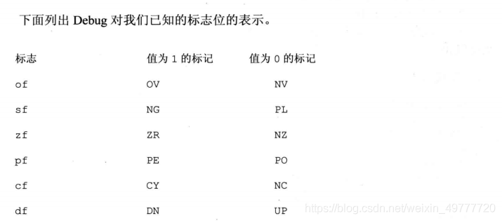

# 各个寄存器

**cs:ip**:决定cpu读取命令物理地址。

**ss:sp**:始终指向栈顶，决定栈的机制。

**ds**：决定cpu读取数据的基础地址。

**loop cx**：loop命令循环次数取决于cx。

**dx**：可作为累加寄存器。

**es**：附加寄存器。

# 通用寄存器

8086CPU寄存器是16位的，可以存放两个字节。

 - 通用寄存器（存放一般数据）：AX、BX、CX、DX。

    AX分为AH和AL（AH和AL都是八位,AH为高位字节，AL为低位字节）其余通用寄存器以此类推。

 - 段寄存器（提供段地址）：CS、DS、SS、ES

 - 寄存器（提供偏移地址）：IP、SP、BP

 - 与bx作用类似：SI、DI

 - 标志寄存器：PSW

## bx si di bp

他们可以通过[ ]表示数据。

他们可以单独出现或以 bx si，bx di，bp si，bp di这四种组合出现。

bx默认的段地址是ds。

bp默认的段地址是ss。

# DS和[address]

用mov将内存单元中的内容送入寄存器中。

格式：mov 寄存器名，内存单元地址。例：mov ax,[0]

[0]表示的是偏移地址，而段地址是DS的值。

同理可以将寄存器中的值送到内存单元中

## 补充：改变DS值的方法

```asm
mov bx,1000H
mov ds,bx
```

这两条指令运行后，ds的值就改为1000H了。

# [bx]

[bx]：表示的是ds:bx所表示位置的数据

# SI 和 DI

与bx作用类似。

# 标志寄存器

他就是flag，他储存的信息被称为程序状态字(PSW)。


## 标志

ZF标志：零标志位，记录相关指令执行后结果是否为零，结果是零zf=1，不是零zf=0

PF标志：奇偶标志位，记录相关指令执行后结果中1的个数是否为偶数，1的个数为偶数pf=1，为奇数pf=0

SF标志：符号标志位，记录相关指令执行后结果是否为负，结果为负sf=1，非负sf=0

CF标志：进位标志位，（无符号数运算）记录运算结果的最高有效位向更高位的进位值，或借位值。

OF标志：溢出标志位，记录（有符号数）运算的结果是否发生溢出，如果发生溢出of=1，没有溢出of=0

DF标志：方向标志位，在串处理指令中，控制si，di增减。df=0 每次操作后si di递增，df=1 每次操作后si di递减

## 标志存储器Debug中表示


