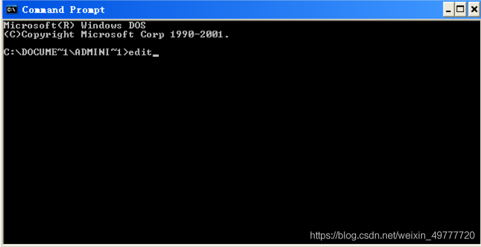
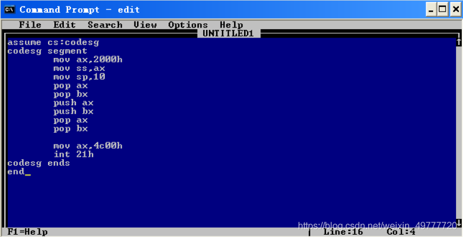
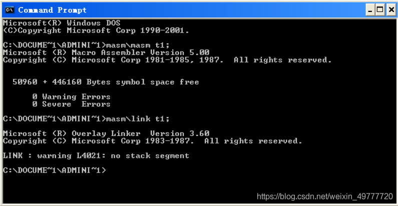
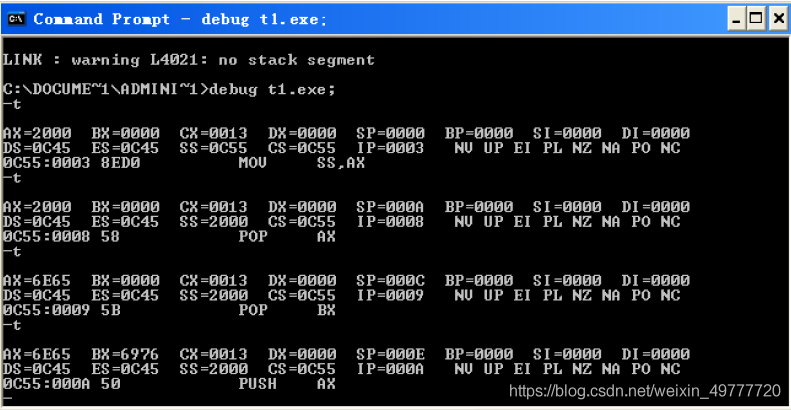
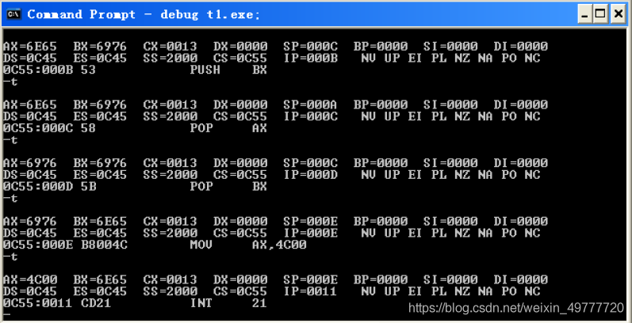

# dosbox汇编命令

 - R：查看、改变CPU寄存器的内容。

 - D：查看内存中的内容。

 - E：改写内存中的内容。

 - U：将内存中的机器指令翻译成汇编指令。

 - T：执行一条机器指令。

 - A：以汇编指令的格式在内存中写入一条机器指令。

**D命令**

```asm
d 段地址(ds):偏移地址
```

# 汇编程序基本结构

例：

```asm
assume cs:codesg
codesg segment
    mov ax,0123h
    mov bx,0456h
    add ax,bx
    add ax,ax

    mov ax,4c00h
    int 21h
codesg ends
end
```

# 伪指令

例中有三种伪指令。

1.他们表示一个段开始，和段结束。

```asm
XXX segment

...

XXX ends
```
2.end：他是汇编程序结束的标记。

3.assume：这句含义是“假设”。用assume将有特定用途的段和相关的的段寄存器关联起来。

4.程序返回：int 21h是程序返回。将程序返回到主程序。

# 运行一个程序

用edit命令打开文本编辑，编辑程序。



编辑程序并保存为asm文件，取名为t1。



用masm t1；命令编译为obj文件。


用link t1；命令编译为exe文件。



用debug t1.exe；命令来运行程序。





最后int 要用p命令来运行。


# dw伪指令

```asm
dw 0123h, 0456h,0789h,0abch,0defh,0fedh,0cbah,0987h
```

例一：从cs:0开始存储后面的数据

```asm
assume cs:code
code segment

    dw 0123h,0456h,0789h,0abch,0defh,θfedh,0cbah,0987h

start:  mou bx,0
        mou ax,0

        mou cx,8
    s:  add ax,cs:[bx]
        add bx,2
        loop s
    
        mov ax,4c00h
        int 21h
code ends
end start
```

start和end start 共同决定程序的开始位置，跳过dw命令。

例二：将数据逆序存放在段代码中使用栈

```asm
assume cs:codesg
codesg segment

    dw 0123h,0456h,0789h,0abch,0defh,θfedh,0cbah,0987h
    dw 0,0,0,0,0,0,0,0

start:  mov ax,cs
        mov ss,ax
        mov sp,30h

        mov bx,0
        mov cx,8
    s:  push cs:[bx]
        add bx,2
        loop s

        mov bx,0
        mov cx,8
   s0:  pop cs:[bx]
        add bx,2
        loop s0
        
        mov ax,4c00h
        int 21h
codesg ends
end start
```

# 多段程序

可以通过多段程序将数据段地址（ds），栈的段地址（ss）确定下来，方便调用。

```asm
assume cs:code,ds:data,ss:stack

data segment
    dw 0123h,0456h,0789h,0abch,0defh,θfedh,0cbah,0987h
data ends

stack segment
    dw 0,0,0,0,0,0,0,0
stack ends

code segment
start:  mov ax,stack
        mov ss,ax
        mov sp,16

        mov ax,data
        mov ds,ax

        push ds:[0]
        push ds:[2]
        pop ds:[2]
        pop ds:[0]

        mov ax,4c00h
        int 21h
code ends
end start
```

# db伪指令

将abcd转化为ascii码，从cs:0开始写入。

```asm
db 'abcd'
```

例：将一段字符转化为小写，另一段字符转化为大写

```asm
assume cs:codesg,ds:datasg

datasg segment
    db'BaSiC'
    db'iNfOrMaTiOn'
datasg ends

codesg segment
start:  mov ax,datasg
        mov ds,ax
        mov bx,0
        mov cx,5

    s:  mou al,[bx]
        and al,11011111B
        mov [bx],al
        inc bx
        loop s

        mov bx,5
        mov cx,11

   s0:  mov al,[bx]
        or al,00100000B
        mov [bx],al
        inc bx
        loop s0

        mou ax,4c00h
        int 21h
codesg ends
end start
```

# 用内存保存段地址

```asm
assume cs:codesg,ds:datasg
datasg segment
    db 'ibm            '
    db 'dec            '
    db 'dos            '
    db 'uax            '
    dw 0
datasg ends

codesg segment
start:  mov ax,datasg
        mov ds,ax
        mov bx,0
        
        mov cx,4
   s0:  mov ds:[40h],cx
        mov si,θ
        mov cx,3

    s:  mov al,[bx+si]
        and al,11011111b
        mov [bx+si],al
        inc si
        loop s

        add bx,16
        mov cx,ds:[40h]
        loop s0
        
        mov ax,4c00h
        int 21h
codesg ends
end start
```

**还可用栈来保存段地址**

# dd伪指令

dd命令：定义双字节数据。

```asm
dd 1
```

# dup操作符

```asm
db/dw/dd 重复次数 dup (重复的数据)
```

# offset操作符

获取编译器处理符号的偏移地址。

```asm
assume cs:codesg
codesg segment
start:  mov ax, offset start    ;相当于mov ax,0
    s:  mov ax,offset s         ;相当于mov ax,3
codesg ends
end start
```