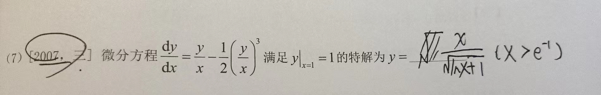
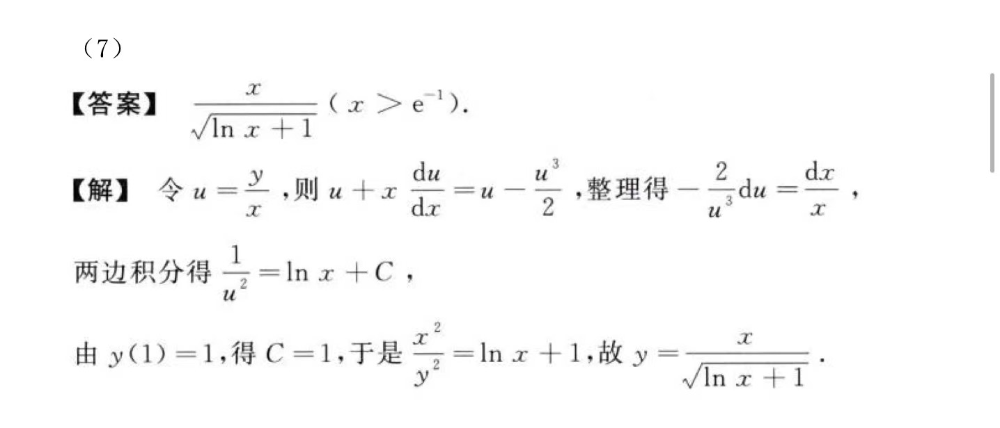

# 函数 极限 连续

数列极限：

+ 趋向$\infty$

+ 趋向0

+ 趋向常数

函数：

+ 分段函数/初等函数

+ 间断函数/连续函数

$e^{+\infty}=\infty$

$e^{-\infty}=0$

$狗 \rightarrow 0$ 的泰勒公式：

+ $\sin x=x-\frac{x^{3}}{3!}+O(x^{3})$

注意：字母常数可能为零。

# 一元函数微分学

拐点定义：连续曲线弧上的凹与凸的分界点称为曲线弧的拐点。

# 微分方程

## 2007，三

难点是答案第三行积分后`ln x`未加绝对值。

